<!-- ===================== HEADER ===================== -->

 

---

## 👨‍💻 About Me

### 🎓 3rd Year B.Tech · CSE (AI & ML) · VIT Bhopal · CGPA 8.91

### 🗺️ My Learning Path

```mermaid
flowchart LR
    A([🧮 Classical ML]):::done --> B([💬 NLP]):::done --> C([🧠 Deep Learning]):::now --> D([⚡ Modern Architectures]):::now --> E([🤖 LLMs & GenAI]):::now --> F([🔎 RAG]):::now --> G([🚀 Production AI]):::next

    classDef done fill:#06d6a0,stroke:#ffffff,stroke-width:2px,color:#000000
    classDef now fill:#8338ec,stroke:#ff006e,stroke-width:3px,color:#ffffff
    classDef next fill:#ffbe0b,stroke:#ffffff,stroke-width:2px,color:#000000
```

🟢 **Done** &nbsp;·&nbsp; 🟣 **Learning right now** &nbsp;·&nbsp; 🟡 **Up next**

 

<table>
<tr>
<td width="50%" valign="top">

### 🔥 Currently Leveling Up

- 🧠 **Deep Learning**: neural networks, sequence models and modern attention-based architectures
- ✨ **Generative AI**: how large language models work under the hood
- 🔎 **RAG (Retrieval-Augmented Generation)**: making LLMs answer from real, external knowledge
- 🛡️ Applying ML to **security** problems
- 🧩 **DSA** to keep problem solving sharp

</td>
<td width="50%" valign="top">

### 🎯 Roadmap

- [x] Classical ML & model evaluation
- [x] NLP pipelines & text classification
- [x] Model deployment (Flask / Streamlit)
- [ ] **Deep Learning** & modern architectures *(in progress)*
- [ ] **Generative AI & LLMs** *(in progress)*
- [ ] **RAG systems** *(in progress)*
- [ ] MLOps & scalable model serving
- [ ] Backend engineering for AI systems

</td>
</tr>
</table>

<b>🔎 What I'm learning in RAG (click to expand)</b>

 

| Concept | What I'm exploring |
|---|---|
| 🧬 **Embeddings** | Turning text into vectors that capture meaning |
| 🗄️ **Vector Databases** | Storing embeddings and running similarity search |
| ✂️ **Chunking Strategies** | Splitting documents so retrieval stays relevant |
| 🎯 **Retrieval & Re-ranking** | Finding and ordering the most useful context |
| 🧾 **Grounded Prompting** | Feeding retrieved context to an LLM to reduce hallucination |
| 📏 **RAG Evaluation** | Measuring retrieval quality and answer faithfulness |

---

## 🛠️ Tech Arsenal

**Languages**

**AI / ML / Data**

**Web / Deployment**

**Databases & Tools**

<b>🧬 Skill Map (click to expand)</b>

 

| Domain | What I work with |
|---|---|
| 🤖 **Machine Learning** | Supervised learning, Random Forest, Logistic Regression, XGBoost, feature engineering, stratified sampling, class-imbalance handling |
| 🧠 **Deep Learning** *(learning)* | Neural networks, sequence modelling and modern attention-based architectures |
| 💬 **NLP** | Tokenization, stopword removal, lemmatization, TF-IDF, text classification |
| ✨ **Generative AI** *(learning)* | Foundations of generative models and how modern LLMs work |
| 🔎 **RAG** *(learning)* | Embeddings, vector search, chunking, retrieval and grounded LLM responses |
| 📊 **Model Evaluation** | Accuracy, Precision, Recall, F1, ROC-AUC, confusion matrix, classification reports |
| 🚀 **Deployment** | Flask REST APIs, Streamlit apps, Pickle serialization, file-upload inference |
| 🧱 **Core CS** | Data Structures & Algorithms, OOP (Java), Operating Systems, DBMS |
| 🌐 **Web** | HTML, CSS, JavaScript, React, Bootstrap |

---

## 🚀 Featured Projects

<table>
<tr>
<td width="50%" valign="top">

### 📰 AI Fake News Detection
*NLP · Binary Text Classification · Live Demo App*

Detects **FAKE vs REAL** news from pasted text or article URLs.

- 🧹 Full NLP pipeline with **NLTK**: tokenization, stopword removal, lemmatization, regex cleaning
- 🔤 **TF-IDF** features + **Logistic Regression** & **Random Forest**
- 📈 **98.4% accuracy · 98.5% precision · 98.4% recall · 98.5% F1**
- 🧪 Evaluated with classification report and confusion matrix
- 🌐 Deployed with **Streamlit** for real-time predictions
- 💾 Model and vectorizer serialized with **Pickle** for reusable inference

`Python` `NLTK` `Scikit-learn` `TF-IDF` `Streamlit`

</td>
<td width="50%" valign="top">

### 🛡️ AI Malware Detection
*Security ML · Static Analysis · REST API*
🏆 Built at **HackSecure Hackathon** (Sep–Oct '25)

A static ML-based malware classifier that needs no code execution.

- 🔬 Features from **entropy-based randomness detection** and **byte-distribution profiling** (byte histograms)
- 🌲 **200-tree Random Forest** classifier
- ⚖️ **Stratified sampling** to handle class imbalance, with **ROC-AUC** evaluation
- ⚡ Production-ready **Flask REST API** with file upload and probabilistic predictions

`Python` `Scikit-learn` `Random Forest` `Flask`

</td>
</tr>
</table>

> 💡 More projects in the **Deep Learning** and **Generative AI** space are on the way. Watch this space.

---

## 📈 GitHub Analytics

 

 

---

## 🏅 Certifications

<b>📜 Click to view all certifications</b>

 

| Certification | Issuer |
|---|---|
| 🔵 OCI Data Science | Oracle |
| ☕ Java Foundation Associate | Oracle |
| 🤖 Applied Machine Learning in Python | University of Michigan (Coursera) |
| ✨ Generative AI | NPTEL |
| ☁️ Cloud Computing | NPTEL |
| 🐍 100 Days of Code: Python | Udemy |
| 🌐 Full Stack Web Development | Udemy |

---

## 🧩 Problem Solving & Growth

- 🧮 Regular **DSA / LeetCode** practice: arrays, strings, recursion, linked lists, binary search, trees
- 📚 Consistent academic performance: **CGPA 8.91** at VIT Bhopal
- 🛠️ Picking up modern AI-assisted dev tools and deployment platforms like **Vercel** and **Antigravity**

---

## 🎓 Education

| Institution | Program | Duration |
|---|---|---|
| **Vellore Institute of Technology, Bhopal** | B.Tech CSE (AI & ML), CGPA 8.91 | Sep '24 – Present |

---

## 🤝 Let's Connect

I'm open to **internships, collaborations and ML/AI projects**.

 

*"Models are trained on data, but careers are trained on consistency."* ⚡

